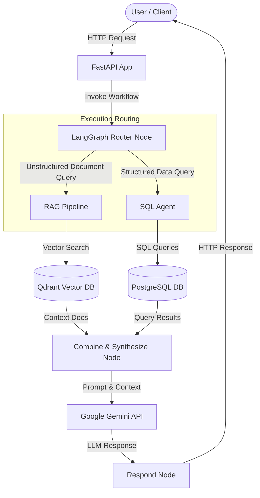

# GenAI Data Assistant Monorepo

A scalable, production-ready monorepo boilerplate for a **Generative AI Data Assistant** built with Python 3.12, FastAPI, LangChain, LangGraph, Google Gemini API, PostgreSQL, Qdrant, Docker Compose, `uv`, SQLAlchemy, Alembic, Ruff, and Pytest.

---

## Architecture Overview

The GenAI Data Assistant acts as an intelligent router and orchestration engine. Incoming user queries are parsed by a LangGraph Router node, which delegates tasks to either:
1. **RAG Pipeline**: Retrieves vector context from Qdrant for document/unstructured data queries.
2. **SQL Agent**: Formulates and executes safe SQL queries against PostgreSQL for structured business analytics (e.g., revenue queries on customers, products, and orders).

Results are combined and passed to the Google Gemini API to synthesize high-quality user responses.



---

## Project Structure

```text
genai-data-assistant/
│
├── apps/
│   └── api/                  # FastAPI Application Service
│       ├── app/
│       │   ├── api/          # Route handlers (/health, /chat, /documents)
│       │   ├── core/         # Logging middleware, exception handlers, config
│       │   ├── services/     # Service layer business logic interfaces
│       │   ├── models/       # Pydantic API schemas
│       │   ├── dependencies/ # FastAPI dependency injectors
│       │   └── main.py       # App initialization & middleware binding
│       ├── tests/            # Integration & unit test suite (pytest)
│       ├── Dockerfile        # Production Dockerfile (python:3.12-slim, non-root user)
│       ├── pyproject.toml    # API dependencies & Ruff/Pytest configuration
│       └── uv.lock           # Locked dependency tree
│
├── packages/                 # Shared Monorepo Packages
│   ├── rag/                  # Document ingestion, embeddings & retriever skeletons
│   ├── sql_agent/            # DB schema inspector, query validator & SQL agent skeletons
│   ├── graph/                # LangGraph state definition, router & workflow DAG
│   ├── shared/               # Shared settings (Pydantic), logging & utility modules
│   └── config/               # Gemini LLM client setup & Alembic database migrations
│
├── data/
│   ├── documents/            # Volume placeholder for document storage
│   └── postgres/             # PostgreSQL persistent data storage
│
├── infra/
│   ├── docker-compose.yml    # Multi-container setup (API, Postgres, Qdrant)
│   ├── postgres/
│   │   └── init.sql          # Seed script: customers, products, orders schema & data
│   └── qdrant/               # Qdrant volume storage
│
├── scripts/
│   ├── setup.sh              # Local development setup script
│   └── wait-for-services.sh  # Readiness check for DB & Qdrant before boot
│
├── .env.example              # Environment variables template
├── .gitignore                # Version control ignore rules
├── Makefile                  # Helper commands for local dev & docker management
└── README.md                 # Project documentation
```

---

## Getting Started

### Prerequisites

- Python 3.12+
- [`uv`](https://github.com/astral-sh/uv) package manager
- Docker and Docker Compose
- Make (optional, for helper commands)

### Environment Configuration

1. Copy `.env.example` to `.env`:
   ```bash
   cp .env.example .env
   ```
2. Set your `GEMINI_API_KEY` in `.env`:
   ```env
   GEMINI_API_KEY=your_actual_gemini_api_key
   ```

### Quick Setup

Run the automated setup script:
```bash
make setup
# OR
bash scripts/setup.sh
```

---

## Running with Docker Compose

Spin up the entire stack (FastAPI, PostgreSQL 16, and Qdrant) using Docker Compose:

```bash
make up
# OR
docker compose -f infra/docker-compose.yml up --build -d
```

### Accessing Services

- **FastAPI Health Check**: [http://localhost:8000/health](http://localhost:8000/health)
- **Interactive Swagger Documentation**: [http://localhost:8000/docs](http://localhost:8000/docs)
- **PostgreSQL Database**: `localhost:5432` (`db: assistant`, `user: genai`, `pass: genai`)
- **Qdrant REST API**: `localhost:6333`

To stop services:
```bash
make down
```

To tail logs:
```bash
make logs
```

---

## Development & Testing

### Running Tests

Run the Pytest suite for the FastAPI application:
```bash
make test
```

### Code Formatting & Linting

Verify and fix code formatting using Ruff:
```bash
make lint
make format
```

---

## API Endpoint Specification

| Method | Endpoint | Status | Description |
|---|---|---|---|
| `GET` | `/health` | **200 OK** | Health check returning service status, timestamp, and version |
| `POST` | `/chat` | **501 Not Implemented** | Future endpoint for invoking LangGraph agent workflow |
| `POST` | `/documents/ingest` | **501 Not Implemented** | Future endpoint for RAG document ingestion pipeline |
| `GET` | `/documents` | **501 Not Implemented** | Future endpoint for listing ingested vector documents |
| `DELETE` | `/documents/{id}` | **501 Not Implemented** | Future endpoint for purging document embeddings |

---

## Future Roadmap & Milestones

1. **Phase 1: Architecture Setup** *(Completed)*
   - Monorepo folder layout & package organization
   - FastAPI structure with health check and 501 placeholders
   - Structured logging middleware & centralized error handlers
   - Docker Compose setup with PostgreSQL & Qdrant
   - LangGraph DAG preparation & Gemini client setup

2. **Phase 2: RAG Pipeline Implementation** *(Upcoming)*
   - Document loaders & chunking strategies in `packages/rag/ingest.py`
   - Gemini Embedding integrations in `packages/rag/embeddings.py`
   - Qdrant collection setup & hybrid vector search in `packages/rag/retriever.py`

3. **Phase 3: SQL Agent & Database Integration** *(Upcoming)*
   - DB reflection & schema extraction in `packages/sql_agent/database.py`
   - SQL safety validator & AST parser in `packages/sql_agent/validator.py`
   - LangChain/SQLAlchemy query generation agent in `packages/sql_agent/agent.py`

4. **Phase 4: LangGraph Routing & Orchestration** *(Upcoming)*
   - Intent classifier node logic in `packages/graph/router.py`
   - State transition DAG and condition evaluations in `packages/graph/workflow.py`
   - Response synthesis using Gemini in `/chat` endpoint
