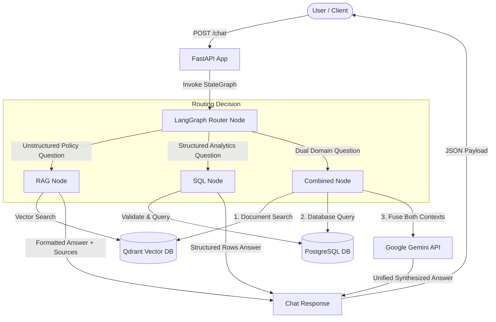

# GenAI Data Assistant Monorepo

A scalable, production-ready monorepo boilerplate for a **Generative AI Data Assistant** built with Python 3.12, FastAPI, LangChain, LangGraph, Google Gemini API, PostgreSQL, Qdrant, Docker Compose, `uv`, SQLAlchemy, Alembic, Ruff, and Pytest.

---

## Architecture Overview

The GenAI Data Assistant uses a **LangGraph StateGraph DAG** to orchestrate incoming requests. Incoming user questions submitted to `POST /chat` are evaluated by a **LangGraph Router node**, which dynamically routes execution across three specialized execution branches:
1. **RAG Branch (`route: "rag"`)**: Retrieves vector embeddings from Qdrant for unstructured document and policy questions (e.g. employee handbooks, refund rules).
2. **SQL Agent Branch (`route: "sql"`)**: Formulates, validates, and executes read-only PostgreSQL queries for structured business analytics (e.g. revenue, order counts, top spenders).
3. **Combined Branch (`route: "combined"`)**: Executes both document context retrieval and database analytics, fusing both sources into a unified response using Google Gemini (`gemini-3.6-flash`).



### Intelligent Routing Decision Matrix

| Question Example | Classified Route | Target Execution Node | Output Payload |
|---|---|---|---|
| *"What is the leave policy?"* | `rag` | `RAG Node` | Document answer + citations (`sources`) |
| *"Top five customers by revenue?"* | `sql` | `SQL Node` | Database query summary table |
| *"What is the refund policy and how much was refunded last month?"* | `combined` | `Combined Node` | Unified synthesized answer + document citations |

---

## Project Structure

```text
genai-data-assistant/
│
├── apps/
│   └── api/                  # FastAPI Application Service
│       ├── app/
│       │   ├── api/          # Route handlers (/health, /chat, /documents)
│       │   ├── core/         # Logging middleware, exception handlers, config
│       │   ├── services/     # Service layer business logic interfaces
│       │   ├── models/       # Pydantic API schemas
│       │   ├── dependencies/ # FastAPI dependency injectors
│       │   └── main.py       # App initialization & middleware binding
│       ├── tests/            # Integration & unit test suite (pytest)
│       ├── Dockerfile        # Production Dockerfile (python:3.12-slim, non-root user)
│       ├── pyproject.toml    # API dependencies & Ruff/Pytest configuration
│       └── uv.lock           # Locked dependency tree
│
├── packages/                 # Shared Monorepo Packages
│   ├── rag/                  # Document ingestion, chunking, embeddings & retriever modules
│   ├── sql_agent/            # DB schema inspector, query validator & SQL agent skeletons
│   ├── graph/                # LangGraph state definition, router & workflow DAG
│   ├── shared/               # Shared settings, Gemini client, logging & utilities
│   └── config/               # Alembic database migrations & Third-party integrations
│
├── data/
│   ├── documents/            # Physical document storage location (data/documents/<uuid>_<filename>)
│   └── postgres/             # PostgreSQL persistent data storage
│
├── infra/
│   ├── docker-compose.yml    # Multi-container setup (API, Postgres, Qdrant)
│   ├── postgres/
│   │   └── init.sql          # Seed script: customers, products, orders, documents schema & data
│   └── qdrant/               # Qdrant volume storage
│
├── scripts/
│   ├── setup.sh              # Local development setup script
│   └── wait-for-services.sh  # Readiness check for DB & Qdrant before boot
│
├── .env.example              # Environment variables template
├── .gitignore                # Version control ignore rules
├── Makefile                  # Helper commands for local dev & docker management
└── README.md                 # Project documentation
```

---

## Document Pipeline, Embeddings & Qdrant Indexing

### Ingestion & Indexing Flow
```text
Document Upload
      ↓
File Storage (data/documents/<uuid>_<filename>)
      ↓
Document Parser (PyPDFLoader, Docx2txtLoader, TextLoader)
      ↓
Document Chunker (RecursiveCharacterTextSplitter)
      ↓
Embedding Generation (GoogleGenerativeAIEmbeddings: text-embedding-004)
      ↓
Vector Indexing (Qdrant PointStruct with payload & cosine distance)
      ↓
Metadata Persistence (PostgreSQL documents table) & API Response
```

### Embedding & Qdrant Configuration
Vector embeddings are generated using Google Gemini's `text-embedding-004` model (768-dimensional dense vectors) and indexed into Qdrant collection `company_documents`.

- **Embedding Model (`GEMINI_EMBEDDING_MODEL`)**: `text-embedding-004`
- **Embedding Batch Size (`EMBEDDING_BATCH_SIZE`)**: `16` chunks per batch
- **Qdrant Collection (`QDRANT_COLLECTION`)**: `company_documents`
- **Vector Size (`QDRANT_VECTOR_SIZE`)**: `768` (Cosine Distance)

Environment configuration (`.env`):
```env
GEMINI_EMBEDDING_MODEL=text-embedding-004
EMBEDDING_BATCH_SIZE=16
QDRANT_HOST=qdrant
QDRANT_PORT=6333
QDRANT_COLLECTION=company_documents
QDRANT_VECTOR_SIZE=768
CHUNK_SIZE=500
CHUNK_OVERLAP=100
```

### RAG Chat Workflow with Source Citations
When a user submits a question to `POST /chat`:
1. **Semantic Retrieval**: Generates query vector embedding and searches Qdrant for matching document chunks.
2. **Context Assembly & Character Safeguard**: Formats retrieved chunks while respecting `RAG_MAX_CONTEXT_CHARS` (default: 4000 characters).
3. **Grounded Generation**: Passes strictly formatted document context to Gemini with anti-hallucination instructions.
4. **No-Context Safeguard**: If no relevant documents exist or retrieval returns empty results, returns:
   `"I couldn't find relevant information in the uploaded documents."` with `sources: []`.
5. **Source Citations**: Attaches structured document source metadata (`filename`, `page`, `chunk_index`).

Environment configuration (`.env`):
```env
GEMINI_EMBEDDING_MODEL=text-embedding-004
EMBEDDING_BATCH_SIZE=16
QDRANT_HOST=qdrant
QDRANT_PORT=6333
QDRANT_COLLECTION=company_documents
QDRANT_VECTOR_SIZE=768
RAG_TOP_K=5
RAG_SCORE_THRESHOLD=0.5
RAG_MAX_CONTEXT_CHARS=4000
CHUNK_SIZE=500
CHUNK_OVERLAP=100
```

### SQL Schema Introspection, Validation, Generation & Execution Pipeline
1. **Schema Introspection**: The database schema introspection service dynamically reflects PostgreSQL database tables, columns, primary keys, and foreign key relationships using SQLAlchemy inspection with in-memory thread-safe caching.
2. **AST SQL Validation**: Read-only SQL query safety is enforced using `sqlglot` AST parsing before any execution against PostgreSQL:
   - **Allowed Queries**: Single `SELECT` statements and `WITH` (CTEs) that evaluate to read-only `SELECT`.
   - **Disallowed Operations**: `INSERT`, `UPDATE`, `DELETE`, `DROP`, `ALTER`, `CREATE`, `TRUNCATE`, `GRANT`, `REVOKE`, `EXECUTE`, `CALL`, transaction commands (`BEGIN`, `COMMIT`, `ROLLBACK`), and multi-statement queries separated by semicolons.
   - **Security Rationale**: Prevents destructive operations, data manipulation, schema alterations, stored procedure calls, and SQL injection prompt bypasses at the AST level prior to PostgreSQL routing.
3. **Natural Language to SQL Generation**: Converts business questions into valid PostgreSQL queries using Google Gemini:
   - **Schema-Aware Prompting**: Inject dynamic table schemas, column data types, primary keys, and foreign keys directly into the Gemini prompt instructions.
   - **Output Cleaning**: Strips markdown code block fences (` ```sql ... ``` `) and normalizes SQL text without executing queries against PostgreSQL.
4. **Safe SQL Query Execution**: Executes validated `SELECT` queries against PostgreSQL:
   - **Validation-Before-Execution Guarantee**: Every query passes through AST validation before reaching the database; invalid or destructive queries are blocked immediately.
   - **Configurable Row Limits**: Capped at `MAX_SQL_ROWS` (default: 100) to prevent oversized responses.
   - **Structured Query Logging**: Logs timestamp, natural language question, generated SQL, validation outcome, row count, and execution duration.

---

## API Endpoints & Specification

| Method | Endpoint | Status | Description |
|---|---|---|---|
| `GET` | `/health` | **200 OK** | Health check returning service, Qdrant connectivity, & Gemini configuration status |
| `POST` | `/chat` | **200 OK** | RAG-powered chat endpoint returning grounded Gemini answer with source citations |
| `POST` | `/documents/ingest` | **201 Created** | Upload, parse, chunk, embed document, index in Qdrant, and return chunk count |
| `GET` | `/documents` | **200 OK** | List all uploaded document records |
| `DELETE` | `/documents/{id}` | **200 OK** | Delete document record, purge file from disk, and remove vectors from Qdrant |
| `POST` | `/documents/search` | **200 OK** | Semantic document similarity search endpoint returning ranked chunks with metadata |
| `GET` | `/database/schema` | **200 OK** | Dynamic database schema introspection endpoint returning tables, columns, & relationships |
| `POST` | `/database/validate-sql` | **200 OK** | Validates input SQL statement for read-only SELECT compliance using AST parsing |
| `POST` | `/database/generate-sql` | **200 OK** | Generates read-only PostgreSQL query statement from natural language question using Gemini |
| `POST` | `/database/query` | **200 OK** | Full pipeline: generates, validates, and executes read-only SQL query returning structured rows |


---

## Usage Examples

### 1. Upload, Chunk, & Embed a Document

```bash
curl -X POST "http://localhost:8000/documents/ingest" \
  -H "accept: application/json" \
  -H "Content-Type: multipart/form-data" \
  -F "file=@employee_handbook.pdf"
```

**Response (`201 Created`)**:
```json
{
  "id": "1728275e-c75b-479e-87d8-8aaab5b3dd44",
  "filename": "employee_handbook.pdf",
  "status": "ingested",
  "chunks_created": 42
}
```

### 2. List Ingested Documents

```bash
curl -X GET "http://localhost:8000/documents"
```

**Response (`200 OK`)**:
```json
[
  {
    "id": "1728275e-c75b-479e-87d8-8aaab5b3dd44",
    "filename": "employee_handbook.pdf",
    "type": "pdf"
  }
]
```

### 3. Delete a Document

```bash
curl -X DELETE "http://localhost:8000/documents/1728275e-c75b-479e-87d8-8aaab5b3dd44"
```

**Response (`200 OK`)**:
```json
{
  "message": "Document deleted"
}
```

### 4. Semantic Search Test Endpoint

```bash
curl -X POST "http://localhost:8000/documents/search" \
  -H "Content-Type: application/json" \
  -d '{"query": "What is the leave policy?", "top_k": 3}'
```

**Response (`200 OK`)**:
```json
{
  "results": [
    {
      "chunk_id": "00000000-0000-0000-0000-000000000001",
      "document_id": "1728275e-c75b-479e-87d8-8aaab5b3dd44",
      "filename": "employee_handbook.pdf",
      "file_type": "pdf",
      "page": 14,
      "chunk_index": 0,
      "text": "Employees receive 20 annual leave days per calendar year.",
      "score": 0.9342
    }
  ]
}
```

### 5. LangGraph Intelligent Chat Endpoint (`POST /chat`)

#### RAG Route Example (`route: "rag"`):
```bash
curl -X POST "http://localhost:8000/chat" \
  -H "Content-Type: application/json" \
  -d '{"message": "What is the refund policy?"}'
```

**Response (`200 OK`)**:
```json
{
  "answer": "Refunds are allowed within 30 days of purchase upon presenting original proof of purchase.",
  "route": "rag",
  "sources": [
    {
      "filename": "refund_policy.pdf",
      "page": 3,
      "chunk_index": 1
    }
  ],
  "provider": "gemini",
  "model": "gemini-2.5-flash"
}
```

#### SQL Route Example (`route: "sql"`):
```bash
curl -X POST "http://localhost:8000/chat" \
  -H "Content-Type: application/json" \
  -d '{"message": "Top 5 customers by revenue"}'
```

**Response (`200 OK`)**:
```json
{
  "answer": "Based on database query (`SELECT c.name, SUM(o.total_amount) AS revenue FROM customers c JOIN orders o ON c.id = o.customer_id GROUP BY c.name ORDER BY revenue DESC LIMIT 5;`):\n\nColumns: [name | revenue]\nData Rows:\nAlice | 1200\nBob | 950",
  "route": "sql",
  "sources": [],
  "provider": "gemini",
  "model": "gemini-2.5-flash"
}
```

#### Combined Route Example (`route: "combined"`):
```bash
curl -X POST "http://localhost:8000/chat" \
  -H "Content-Type: application/json" \
  -d '{"message": "What is the refund policy and how much was refunded last month?"}'
```

**Response (`200 OK`)**:
```json
{
  "answer": "According to company policy, refunds are permitted within 30 days of purchase. Based on database analytics, a total of $450.00 was refunded across 3 orders last month.",
  "route": "combined",
  "sources": [
    {
      "filename": "refund_policy.pdf",
      "page": 3,
      "chunk_index": 1
    }
  ],
  "provider": "gemini",
  "model": "gemini-2.5-flash"
}
```

### 6. Get Database Schema (`GET /database/schema`)

```bash
curl -X GET "http://localhost:8000/database/schema?force_refresh=false"
```

**Response (`200 OK`)**:
```json
{
  "database_name": "assistant",
  "tables": [
    {
      "name": "customers",
      "columns": [
        {"name": "id", "type": "INTEGER", "nullable": false, "primary_key": true, "default": null},
        {"name": "name", "type": "VARCHAR", "nullable": false, "primary_key": false, "default": null}
      ],
      "primary_keys": ["id"],
      "foreign_keys": []
    }
  ],
  "relationships": [],
  "inspected_at": "2026-09-25T12:00:00.000000+00:00"
}
```

### 7. Validate SQL Query (`POST /database/validate-sql`)

```bash
curl -X POST "http://localhost:8000/database/validate-sql" \
  -H "Content-Type: application/json" \
  -d '{"sql": "SELECT * FROM customers;"}'
```

**Response (`200 OK`)**:
```json
{
  "valid": true,
  "reason": "Query passed read-only validation.",
  "statement_type": "SELECT"
}
```

**Destructive Query Example Response**:
```json
{
  "valid": false,
  "reason": "Disallowed SQL statement type 'DELETE'. Only read-only SELECT statements are permitted.",
  "statement_type": "DELETE"
}
```

### 8. Generate SQL from Natural Language (`POST /database/generate-sql`)

```bash
curl -X POST "http://localhost:8000/database/generate-sql" \
  -H "Content-Type: application/json" \
  -d '{"question": "Which are the top 5 customers by revenue?"}'
```

**Response (`200 OK`)**:
```json
{
  "question": "Which are the top 5 customers by revenue?",
  "sql": "SELECT c.name, SUM(o.total_amount) AS revenue FROM customers c JOIN orders o ON c.id = o.customer_id GROUP BY c.name ORDER BY revenue DESC LIMIT 5;"
}
```

### 9. Execute Natural Language SQL Query Pipeline (`POST /database/query`)

```bash
curl -X POST "http://localhost:8000/database/query" \
  -H "Content-Type: application/json" \
  -d '{"question": "Top 5 customers by revenue"}'
```

**Response (`200 OK`)**:
```json
{
  "question": "Top 5 customers by revenue",
  "sql": "SELECT c.name, SUM(o.total_amount) AS revenue FROM customers c JOIN orders o ON c.id = o.customer_id GROUP BY c.name ORDER BY revenue DESC LIMIT 5;",
  "columns": ["name", "revenue"],
  "rows": [
    ["Alice", 1200],
    ["Bob", 950]
  ],
  "row_count": 2,
  "execution_duration_ms": 14.2
}
```

---

## Development & Testing

### Running Tests

Run the Pytest suite (including SQL executor, generator, and validator unit tests):
```bash
make test
```

### Code Formatting & Linting

Verify and fix code formatting using Ruff:
```bash
make lint
make format
```


