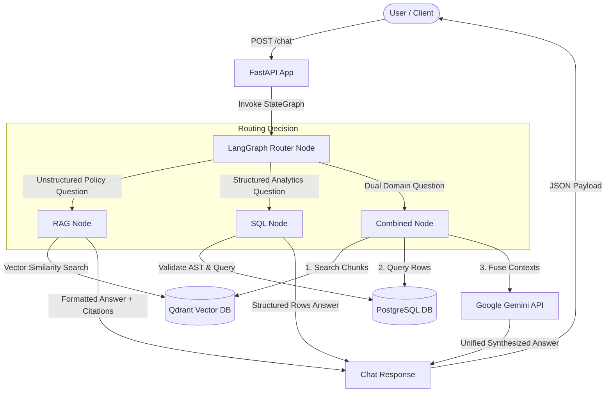

# GenAI Data Assistant Monorepo

[](https://www.python.org/)
[](https://fastapi.tiangolo.com/)
[](https://www.langchain.com/langgraph)
[](https://qdrant.tech/)
[](https://www.postgresql.org/)
[](https://www.docker.com/)

An enterprise-grade, production-ready **Generative AI Data Assistant** monorepo powering natural language interactions across unstructured document collections (RAG) and structured relational databases (SQL). Built with Python 3.12, FastAPI, LangChain, LangGraph, Google Gemini API, PostgreSQL 16, Qdrant Vector DB, Docker Compose, `uv`, SQLAlchemy, and Pytest.

---

## Project Overview

Modern enterprise data resides in both unstructured text documents (handbooks, SOPs, policies) and structured relational SQL databases (customers, orders, inventory). 

The **GenAI Data Assistant** unifies both domains into a single natural language conversational interface:
- **Why RAG?** RAG (Retrieval-Augmented Generation) parses, chunks, and indexes company policy documents into Qdrant vector space, allowing users to query document knowledge with exact source citations.
- **Why SQL Agent?** The SQL Agent dynamically reflects PostgreSQL database schemas and converts natural language questions into safe, read-only `SELECT` queries with AST security validation.
- **Why LangGraph?** Standard sequential LLM chains are too linear. LangGraph's `StateGraph` DAG dynamically classifies user intent and routes execution across `rag`, `sql`, or `combined` processing branches.

---

## Features

- [x] **Document RAG**: Ingests PDF, DOCX, TXT, and Markdown files into Qdrant vector space.
- [x] **Recursive Chunking**: Configurable chunk size (500) and overlap (100) using `RecursiveCharacterTextSplitter`.
- [x] **Gemini Dense Embeddings**: Generates 768-dimensional embeddings using `text-embedding-004`.
- [x] **Source Citations**: Returns document provenance metadata (`filename`, `page`, `chunk_index`).
- [x] **SQL Schema Introspection**: Dynamic reflection of tables, columns, primary keys, and foreign key relationships.
- [x] **AST Read-Only SQL Validation**: AST parser via `sqlglot` guaranteeing SELECT-only queries.
- [x] **Safe SQL Execution**: Validation-before-execution engine capping maximum returned rows (`MAX_SQL_ROWS=100`).
- [x] **LangGraph Router**: Classifies questions into `rag`, `sql`, or `combined` routes.
- [x] **Conversation Memory**: Thread-safe session tracking supporting context continuation and auto-trimming.
- [x] **FastAPI & Swagger**: Fully annotated OpenAPI documentation with Pydantic v2 schemas.
- [x] **Docker Compose**: Orchestrates API, PostgreSQL 16, and Qdrant containers with healthchecks.

---

## Tech Stack

| Component | Technology / Library | Purpose |
|---|---|---|
| **Language** | Python 3.12 | Core backend programming language |
| **Web Framework** | FastAPI | High-performance async REST API web framework |
| **LLM & Embeddings** | Google Gemini (`gemini-3.6-flash` / `text-embedding-004`) | Generative answer synthesis & 768-dim embeddings |
| **Orchestration** | LangChain & LangGraph | Stateful DAG graph routing & multi-agent workflow |
| **Vector DB** | Qdrant Vector DB | High-performance Cosine similarity vector search |
| **Relational DB** | PostgreSQL 16 | Relational business data storage & SQLAlchemy reflection |
| **AST Parser** | `sqlglot` | Read-only Abstract Syntax Tree SQL safety validator |
| **Package Manager** | `uv` | High-speed dependency resolver & lock manager |
| **Containers** | Docker Compose | Multi-service local & production containerization |
| **Testing** | Pytest (103 tests passing) | Comprehensive unit and E2E integration test suite |

---

## Architecture Diagram


```mermaid
flowchart TD
    User([User / Client]) -->|POST /chat| FastAPI[FastAPI App]
    FastAPI -->|Invoke StateGraph| Router[LangGraph Router Node]
    
    subgraph Routing Decision
        Router -->|Unstructured Policy Question| RAG[RAG Node]
        Router -->|Structured Analytics Question| SQL[SQL Node]
        Router -->|Dual Domain Question| Combined[Combined Node]
    end
    
    RAG -->|Vector Similarity Search| Qdrant[(Qdrant Vector DB)]
    SQL -->|Validate AST & Query| PostgreSQL[(PostgreSQL DB)]
    
    Combined -->|1. Search Chunks| Qdrant
    Combined -->|2. Query Rows| PostgreSQL
    Combined -->|3. Fuse Contexts| Gemini[Google Gemini API]
    
    RAG -->|Formatted Answer + Citations| Response[Chat Response]
    SQL -->|Structured Rows Answer| Response
    Gemini -->|Unified Synthesized Answer| Response
    Response -->|JSON Payload| User
```

---

## Project Structure

```text
genai-data-assistant/
│
├── apps/
│   └── api/                  # FastAPI Application Service
│       ├── app/
│       │   ├── api/          # Route handlers (/health, /chat, /documents, /database, /sessions)
│       │   ├── core/         # Logging middleware, exception handlers, config
│       │   ├── services/     # Service layer business logic interfaces
│       │   ├── models/       # Pydantic API schemas
│       │   ├── dependencies/ # FastAPI dependency injectors
│       │   └── main.py       # App initialization & OpenAPI metadata
│       ├── tests/            # Integration & unit test suite (pytest)
│       ├── Dockerfile        # Production Dockerfile (python:3.12-slim, non-root user)
│       ├── pyproject.toml    # API dependencies & Ruff/Pytest configuration
│       └── uv.lock           # Locked dependency tree
│
├── packages/                 # Shared Monorepo Packages
│   ├── rag/                  # Document ingestion, chunking, embeddings & retriever modules
│   ├── sql_agent/            # DB schema inspector, AST query validator & execution engine
│   ├── graph/                # LangGraph state definition, router, workflow DAG & session memory
│   ├── shared/               # Shared settings, Gemini client, logging & utilities
│   └── config/               # Alembic database migrations blueprint
│
├── data/
│   ├── documents/            # Physical document storage (data/documents/<uuid>_<filename>)
│   └── postgres/             # PostgreSQL persistent data volume
│
├── infra/
│   ├── docker-compose.yml    # Multi-container setup (API, Postgres, Qdrant)
│   ├── postgres/
│   │   └── init.sql          # Seed script: customers, products, orders, documents schema
│   └── qdrant/               # Qdrant volume storage
│
├── scripts/
│   ├── setup.sh              # Local development setup script
│   └── wait-for-services.sh  # Readiness check script
│
├── .dockerignore              # Docker context exclusion rules
├── .env.example              # Environment variables template
├── Makefile                  # Helper commands for testing & docker management
└── README.md                 # Project documentation
```

---

## Setup Guide

### 1. Clone Repository
```bash
git clone https://github.com/anujmindfire/gen-ai-data-assistant.git
cd gen-ai-data-assistant
```

### 2. Environment Configuration
Copy the `.env.example` template to `.env`:
```bash
cp .env.example .env
```
Ensure `GEMINI_API_KEY` is configured in `.env` with a valid Google Gemini API key.

### 3. Local Virtual Environment Setup (`uv`)
```bash
uv sync
```

---

## Environment Variables

| Variable | Purpose | Default Value |
|---|---|---|
| `GEMINI_API_KEY` | Google Gemini API Authentication Key | *Required* |
| `GEMINI_MODEL` | Gemini LLM Model Identifier | `gemini-3.6-flash` |
| `GEMINI_EMBEDDING_MODEL` | Embedding Model for Vector Search | `text-embedding-004` |
| `POSTGRES_HOST` | PostgreSQL Hostname | `postgres` |
| `POSTGRES_PORT` | PostgreSQL Port | `5432` |
| `POSTGRES_DB` | Database Name | `assistant` |
| `POSTGRES_USER` | Database Username | `genai` |
| `POSTGRES_PASSWORD` | Database Password | `genai` |
| `QDRANT_HOST` | Qdrant Service Hostname | `qdrant` |
| `QDRANT_PORT` | Qdrant Service Port | `6333` |
| `QDRANT_COLLECTION` | Qdrant Vector Collection Name | `company_documents` |
| `MAX_CONVERSATION_MESSAGES` | Max Message History Limit per Session | `20` |

---

## Running the Project with Docker Compose

Build and launch all services in containerized mode:
```bash
docker compose -f infra/docker-compose.yml up --build
```

### Containers Started:
1. **`genai-assistant-api`**: FastAPI API application listening at `http://localhost:8000`.
2. **`genai-assistant-postgres`**: PostgreSQL 16 database running at `localhost:5432`.
3. **`genai-assistant-qdrant`**: Qdrant Vector DB engine running at `localhost:6333`.

---

## API Endpoints

| Method | Path | Summary | Description |
|---|---|---|---|
| `GET` | `/health` | Service Health | Health check returning API, PostgreSQL, Qdrant, & Gemini status |
| `POST` | `/chat` | Conversational Chat | RAG & SQL-powered chat endpoint with session memory |
| `GET` | `/sessions/{id}` | Get Session Memory | Retrieves message history for a given session ID |
| `DELETE` | `/sessions/{id}` | Delete Session Memory | Deletes session memory context for a given session ID |
| `POST` | `/documents/ingest` | Ingest Document | Uploads, parses, chunks, embeds, & indexes PDF, DOCX, TXT, MD |
| `GET` | `/documents` | List Documents | Returns metadata array of all registered documents |
| `DELETE` | `/documents/{id}` | Delete Document | Purges document record, physical file, and Qdrant vectors |
| `POST` | `/documents/search` | Similarity Search | Semantic vector search endpoint returning top chunks |
| `GET` | `/database/schema` | DB Schema Metadata | Reflects database tables, columns, PKs, and foreign keys |
| `POST` | `/database/validate-sql` | Validate SQL Safety | Validates input SQL statement for read-only SELECT compliance |
| `POST` | `/database/generate-sql` | Generate SQL | Converts natural language question into PostgreSQL SELECT statement |
| `POST` | `/database/query` | Execute SQL Query | Full Text-to-SQL pipeline returning structured rows |

Interactive Swagger OpenAPI documentation is available at `http://localhost:8000/docs`.

---

## RAG Workflow

```text
Document Upload (.pdf, .docx, .txt, .md)
      ↓
Document Parser (PyPDFLoader, Docx2txtLoader, TextLoader)
      ↓
Recursive Chunker (size: 500, overlap: 100)
      ↓
Embedding Generation (Google Gemini text-embedding-004)
      ↓
Qdrant Vector Indexing (Cosine Distance Metric)
      ↓
Semantic Retrieval & Citation Assembly (filename, page, chunk_index)
      ↓
Grounded Gemini Response Synthesis
```

---

## SQL Workflow

```text
Natural Language Question ("Top customers by revenue")
      ↓
Schema Introspection (SQLAlchemy Reflection & FK Discovery)
      ↓
Schema-Aware Prompt Generation (Gemini LLM)
      ↓
AST Read-Only SQL Validation (sqlglot SELECT-only Parser)
      ↓
PostgreSQL Query Execution (Capped at MAX_SQL_ROWS=100)
      ↓
Structured Summary Table Answer Generation
```

---

## LangGraph Workflow

The stateful workflow graph evaluates incoming user messages:
1. **Router Node (`router`)**: Evaluates user intent and dynamically outputs `rag`, `sql`, or `combined`.
2. **RAG Node (`rag`)**: Handles document similarity search and grounded policy answers.
3. **SQL Node (`sql`)**: Handles database schema reflection, query generation, validation, and execution.
4. **Combined Node (`combined`)**: Concurrent document retrieval and database query execution, fusing both context sources into a unified response.

---

## Demo Scenarios

### 1. Document Question Example (`route: "rag"`)
```bash
curl -X POST "http://localhost:8000/chat" \
  -H "Content-Type: application/json" \
  -d '{"message": "What is the refund policy?"}'
```
**Expected Response**:
```json
{
  "answer": "Refunds are allowed within 30 days of purchase upon presenting original receipt.",
  "session_id": "sess_123abc",
  "route": "rag",
  "sources": [
    {
      "filename": "refund_policy.md",
      "page": 1,
      "chunk_index": 0
    }
  ],
  "provider": "gemini",
  "model": "gemini-3.6-flash"
}
```

### 2. SQL Question Example (`route: "sql"`)
```bash
curl -X POST "http://localhost:8000/chat" \
  -H "Content-Type: application/json" \
  -d '{"message": "Top 5 customers by revenue"}'
```
**Expected Response**:
```json
{
  "answer": "Based on database query (`SELECT c.name, SUM(o.total_amount) AS revenue FROM customers c JOIN orders o ON c.id = o.customer_id GROUP BY c.name ORDER BY revenue DESC LIMIT 5;`):\n\nAlice: $1,200.00\nBob: $950.00",
  "session_id": "sess_456def",
  "route": "sql",
  "sources": [],
  "provider": "gemini",
  "model": "gemini-3.6-flash"
}
```

### 3. Combined Question Example (`route: "combined"`)
```bash
curl -X POST "http://localhost:8000/chat" \
  -H "Content-Type: application/json" \
  -d '{"message": "What is the refund policy and how much was refunded last month?"}'
```
**Expected Response**:
```json
{
  "answer": "According to company policy, refunds are permitted within 30 days of purchase. Based on database analytics, a total of $450.00 was refunded across 3 orders last month.",
  "session_id": "sess_789ghi",
  "route": "combined",
  "sources": [
    {
      "filename": "refund_policy.md",
      "page": 1,
      "chunk_index": 0
    }
  ],
  "provider": "gemini",
  "model": "gemini-3.6-flash"
}
```

---

## Testing & Developer Tooling

### Running Pytest Test Suite
```bash
make test
```
Executes all 103 unit and end-to-end integration tests in `apps/api/tests/`.

### Code Formatting & Linting
```bash
make lint
make format
```
Runs Ruff linter and formatter to enforce code formatting standards.

---

## Troubleshooting Guide

### 1. Missing Gemini API Key
- **Symptom**: `400 Bad Request` or `502 Bad Gateway` returning `GEMINI_CONFIG_ERROR`.
- **Fix**: Verify `GEMINI_API_KEY` is configured in `.env`.

### 2. Qdrant Connection Failure
- **Symptom**: `GET /health` returns `"qdrant": false`.
- **Fix**: Ensure Qdrant container is running (`docker compose up qdrant -d`).

### 3. PostgreSQL Database Connection Failure
- **Symptom**: API fails health check or database connection error.
- **Fix**: Verify PostgreSQL service health (`docker compose ps`) or run `docker compose restart postgres`.

---

## Future Improvements

1. **Persistent Redis Memory Backend**: Upgrade in-memory `ConversationMemoryManager` to a persistent Redis cluster for multi-instance horizontal scaling.
2. **Server-Sent Events (SSE)**: Implement streaming tokens for real-time response rendering in chat web interfaces.
